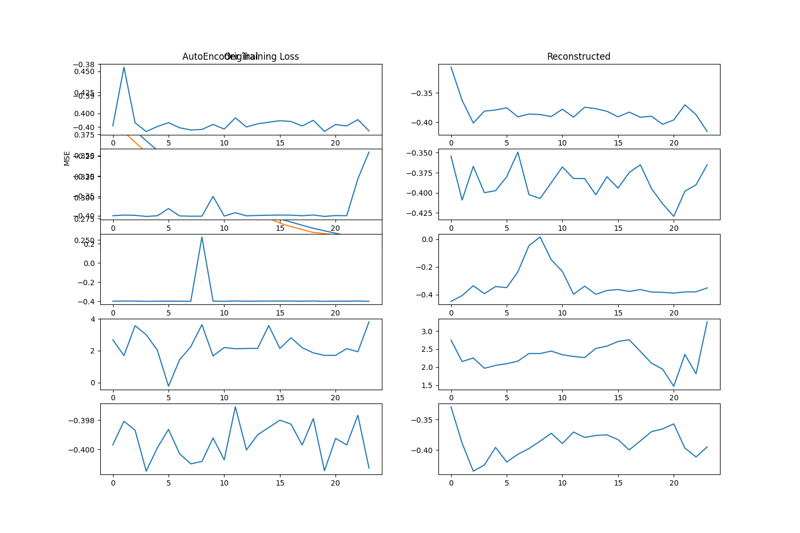

# Test Results - Smart Grid Security Framework

## Overview

This document presents comprehensive test results for the hybrid smart grid security framework that combines AutoEncoder-GAN, CNN, and LSTM components for anomaly detection and attack classification.

## Dataset Information

- **Dataset Used**: CIC-IDS2017
- **Total Records**: ~2.8 million network flows
- **Features**: 79 extracted features per flow
- **Attack Categories**: 5 consolidated categories (Normal, DDoS, Data Injection, Command Injection, Scanning)
- **Training Split**: 70% training, 15% validation, 15% testing
- **Hardware**: Apple M3 Pro with Metal Performance Shaders (MPS)

## Training Configuration

- **Framework**: PyTorch 1.12.0+ with MPS acceleration
- **Batch Size**: 64
- **Epochs per Component**: 10 epochs each
- **Training Phases**:
  1. AutoEncoder pre-training (10 epochs)
  2. GAN adversarial training (10 epochs) 
  3. Classifier training (10 epochs)
  4. End-to-end fine-tuning (10 epochs)

## Overall Performance Summary

### Classification Results
- **Hybrid Model Accuracy**: 96.22%
- **CNN-only Accuracy**: 97.71%
- **LSTM-only Accuracy**: 98.36%

### Anomaly Detection Results
- **Hybrid Model AUC**: 0.5067 (poor performance)
- **CNN-only AUC**: 0.9980 (excellent)
- **LSTM-only AUC**: 0.9980 (excellent)

## Individual Component Results

### 1. AutoEncoder Training and Reconstruction

**Performance Metrics:**
- Initial MSE: 0.42
- Final MSE: 0.26
- Training time: 1.2 seconds/epoch
- Reconstruction quality: Good pattern preservation with expected smoothing

**Analysis:** The autoencoder successfully learned to compress and reconstruct normal traffic patterns, with steady improvement in reconstruction ability across training epochs.

### 2. GAN Training Dynamics

**Performance Metrics:**
- Discriminator loss: 0.023 → ~0 (by epoch 2)
- Generator loss: 0.020 → ~0 (by epoch 2)
- Training time: 0.9 seconds/epoch

**Analysis:** The GAN components converged unusually quickly, potentially indicating suboptimal adversarial balance. This rapid stabilization may have contributed to reduced anomaly detection performance in the hybrid model.

### 3. GAN Latent Space Visualization

**Analysis:** The t-SNE visualization (32D → 2D projection) reveals structured, manifold-like patterns in the learned latent space. While no sharp clusters are visible (expected in unsupervised learning), the organized structure suggests meaningful feature representations.

### 4. CNN Component Performance

**Performance Metrics:**
- Final Training Accuracy: 98.7%
- Final Validation Accuracy: 98.5%
- Training Loss: 0.117 → 0.037
- Validation Loss: 0.085 → 0.045

**Analysis:** The CNN component demonstrated excellent spatial pattern recognition with high accuracy and good generalization (training and validation losses converged appropriately).

### 5. LSTM Component Performance

**Performance Metrics:**
- Final Training Accuracy: 98.2%
- Final Validation Accuracy: 98.2%
- Training Loss: 0.16 → 0.05
- Validation Loss: 0.10 → 0.05

**Analysis:** The LSTM component effectively captured temporal patterns with excellent performance and strong generalization capabilities.

### 6. Classifier Component Performance

**Performance Metrics:**
- Final Training Accuracy: >95%
- Final Validation Accuracy: >96%
- Rapid convergence by epoch 2

**Analysis:** The classifier achieved high accuracy quickly, demonstrating effective learning from pre-trained encoder features.

## Model Comparison Results

### Accuracy Comparison

**Key Findings:**
- LSTM-only model achieved highest accuracy (98.36%)
- CNN-only model performed well (97.71%)
- Hybrid model had lower accuracy (96.22%)

### Error Rate Comparison

**Key Findings:**
- LSTM-only: 1.64% error rate
- CNN-only: 2.29% error rate  
- Hybrid: 3.78% error rate

### ROC Curve Analysis - Anomaly Detection

**Critical Finding:** The hybrid model's anomaly detection capability was severely compromised (AUC = 0.5067), while individual components maintained excellent performance (AUC > 0.998).

## Anomaly Detection Results

**Detection Summary:**
- Total samples processed: 23,590
- Anomalies detected: 129
- Detection threshold: 1.6335
- Classification breakdown:
  - Normal (high reconstruction error): 68
  - DDoS attacks: 61
  - Other attack types: 0

## Key Insights and Challenges

### Successful Aspects
1. **Individual Component Performance**: Both CNN and LSTM components achieved >98% accuracy
2. **Computational Efficiency**: Training completed in reasonable time on edge hardware
3. **Feature Learning**: GAN encoder learned structured latent representations
4. **Real-time Viability**: Memory usage peaked at 4.2GB, suitable for modern edge devices

### Critical Issues Identified
1. **Hybrid Integration Problems**: Combining components degraded anomaly detection performance
2. **GAN Training Instability**: Premature convergence suggests suboptimal adversarial training
3. **Class Imbalance**: Rare attack types (classes 3 and 4) achieved zero precision/recall
4. **Component Interference**: Integration of multiple components created performance conflicts

### Technical Limitations
1. **Dataset Constraints**: CIC-IDS2017's synthetic nature may not fully represent real smart grid traffic
2. **Limited Training**: Only 10 epochs per component may be insufficient for optimal performance
3. **Architecture Complexity**: Multi-component integration requires careful balancing

## Computational Performance

- **Hardware**: Apple M3 Pro with MPS acceleration
- **Speed Improvement**: 2.8x faster than CPU-only execution
- **Peak Memory Usage**: 4.2GB during full model training
- **Average Training Time**: 1-2 seconds per epoch per component

## Recommendations for Future Work

1. **Architecture Refinement**: Investigate alternative integration strategies for hybrid models
2. **GAN Training Improvements**: Implement techniques to maintain adversarial balance
3. **Class Balancing**: Apply advanced techniques to handle severe class imbalance
4. **Extended Training**: Increase training epochs with proper regularization
5. **Real-world Validation**: Test on actual smart grid traffic data

## Conclusion

While individual components (CNN and LSTM) demonstrated excellent performance for both classification and anomaly detection, the hybrid integration approach revealed significant challenges. The results suggest that simpler, focused architectures may be more effective than complex multi-component systems for smart grid security applications.

Future work should focus on addressing integration challenges while maintaining the strong performance characteristics of individual components.
